# FMEA Tool

A tool for generating Failure Modes and Effects Analysis (FMEA) using Retrieval-Augmented Generation (RAG) and an agent-based workflow. It uses Chroma DB for vector storage of knowledge, retrieves context via RAG, and formats FMEA outputs per user specifications.


## Architecture

1. **Knowledge Base**  
   Storage of domain texts, guidelines, prior FMEA examples etc. indexed as embeddings in Chroma DB.

2. **RAG Module**  
   Queries Chroma with user queries / prompts to fetch context relevant to the FMEA instance.

3. **Agent**  
   Uses the RAG-provided context plus user inputs to generate the FMEA Worksheet. Handles structure, formatting, maybe validation.

 
---

## Getting Started

### Installation

```bash
git clone https://github.com/palscruz23/fmea_tool.git
cd fmea_tool
pip install -r requirements.txt
python functions/populate_database.py # Generate vector from knowledge base chunks
streamlit run fmea_tool.py # Open streamlit app for interface
```
Create .env file and enter LLM_API_KEY

## Demo

 